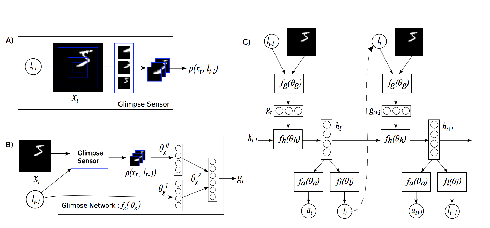
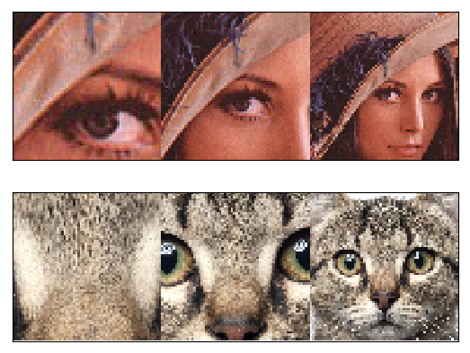

# 使用PaddlePaddle复现论文：[Recurrent Models of Visual Attention](http://de.arxiv.org/pdf/1406.6247)

## 1 简介

 *Recurrent Attention Model* (RAM)，它能顺序处理输入信息，在每个时间步关注图像内不同的子区域，然后增量式的结合来自这些固定位置的信息，并建立图像的动态内部表示。RAM的优点在于能自主选择图像的子区域进行处理，而不像传统的卷积模型一样复杂度随着输入图像像素变大而线性增长。


## 2 网络结构

本文将注意力问题建模为目标导向的agent与视觉环境交互的序列决策过程，agent的核心是一个循环神经网络，它在每一时间步处理来自sensor收集的子图信息，并随着时间推移集成图像信息，并选择如何行动和部署下一个时间步的sensor。



RAM模型结构如上图所示，其中包含如下五个部分：

- **glimpse sensor**:glimpse sensor受到视网膜注意力机制的启发，即人往往能清晰的看见所关注对象的细节（内容少，高分辨率），同时保留对背景的模糊感受（内容多，低分辨率）。于是设计的glimpse sensor能从图像 `x`中提取漏斗状的一瞥（glimpse）`phi`，sensor首先编码靠近位置`l`的一块高像素的小区域，然后再渐进的从l附近取更大且像素更低的子区域（所有的截取的子区域需要缩放到同一大小，所以大图像素低），从而得到原始图像 `x`的压缩表示；
  - 下面第一张图是截取位置l附近不同尺度的区域，然后第二章是将他们缩放到同一尺度，使得细节部分有高分辨率，背景低分辨率。
 
  - 
  
  - 

- **glimpse network**: 该网络将sensor得到的压缩表示"what" (`phi`)和位置信息"where" (`l`)结合起来，得到这一瞥的特征向量`g_t`；
- **core network**: 核心网络是个循环神经网络，该网络维持一个内部状态 `h_t` ，代表从过去观测历史中提取的整合信息。它通过状态向量 `h_t` 编码angent对环境的知识，并且在每个时间步 `t`都会更新。时间步t时的输入为上一个时刻glimpse向量`g_(t-1)`和状态向量`h_(t-1)；`
- **location network**:位置网络，使用rnn状态向量`h_t`，在时间步t时产生shape为[bsz,2]的位置坐标`l_t`，再同输入图像 `x`送入glimpse得到输入向量`g_(t+1)`,同状态向量`h_t`作为t+1时刻rnn的输入；
- **action network**: 在固定数的时间步之后，使用rnn的内部状态‘h_t’生成最终的分类输出 `y`。

总的来说，RAM是围绕rnn展开的，输入是glimpse向量和t时刻状态向量，输出是t+1时刻状态向量，代表集成的图像信息。利用状态向量输入两个子网络location和action 可以得到两个输出：`l_t`和`a_t`，`l_t`用于指导sensor截取子图并编码为输入向量，`a_t`用来完成分类任务。


## 3 实验结果
本项目使用28x28的MNIST数据集来复现，RAM模型包含6个glimpses，patch_size为8x8，缩放因子scale为1。
本项目的验证误差为1.18%，原文和本项目在MNIST测试集上的误差为：

| Task | Paper | Me |
|-------|-------|-------|
| 28x28 MNIST | 1.29%  | 1.18% |

## 4 快速开始
### 4.1 环境、依赖
实验环境以及超参：

| Paddle Version | Memory | Card | Batch Size | Learning Rate | LR Factor | LR Patience | Epoch | Training time |
|-------|-------|-------|-------|-------|-------|-------|-------|-------|
| 2.1.2 | 16G | V100*1  | 128 | 3e-4 | 0.8 | 20 | 290 | ~2h |

注：目前是先用factor=0.1,patience=20训练了200轮，发现142轮达到最优，未达到指定精度，且后面学习率过小为0了。于是从142轮开始恢复训练，初始学习率仍为3e-4，然后factor=0.8，patience=10,
继续训练到290轮，详细见logs里RAM日志。且当前指标是在本地3060环境达到精度，3060一轮约45s，v100一轮约30s。其他实验详见[aistudio](https://aistudio.baidu.com/aistudio/projectdetail/2884954)

依赖安装：`pip install -r requirements`

### 4.2 目录结构
```
.
├── README.md
├── align.py # 转换权重
├── ckpt # 权重
│   └── ram_6_8x8_1_model_best.pdparams
├── config.py # 配置文件
├── data # 数据
│   ├── MNIST
├── data_loader.py # 加载数据
├── logs # 日志
├── main.py # 主函数
├── model.py # RAM主体模型
├── modules.py # RAM5个部分
├── plot_glimpses.py # 画图
├── plots # 图片
├── requirements.txt
├── trainer.py # 训练、评估函数
└── utils.py # 工具
```

### 4.3 模型训练

训练参数在'config.py'里，编辑好后并运行以下命令即可快速开始训练:
```
python main.py
```

恢复训练命令:
```
# 加载历史最佳的ckpt恢复训练
python main.py --resume=True --best True
# 加载最后一轮（n）的ckpt恢复训练
python main.py --resume=True --best False --last_epoch n
```
### 4.4 评估模型
本项目的模型权重ram_6_8x8_1_model_best.pdparams已经上传到百度网盘:[链接](https://pan.baidu.com/s/1V9Uyijxs7OxLTzr1E2mx2w) ,提取码：v6d3

将权重下载下来后放入当前目录下的ckpt，用如下命令评估RAM模型的精度：
```
python main.py --is_train=False  --best True
```

## References

- [Recurrent Models of Visual Attention](http://de.arxiv.org/pdf/1406.6247)

- [kevinzakka/recurrent-visual-attention](https://github.com/kevinzakka/recurrent-visual-attention)

- [MyAistudio](https://aistudio.baidu.com/aistudio/projectdetail/2884954)

- [Recurrent Model of Visual Attention](http://torch.ch/blog/2015/09/21/rmva.html)

- [The Blog of Xiao Wang](https://www.cnblogs.com/wangxiaocvpr/p/5537454.html)

- [RAM： Recurrent Models of Visual Attention 学习笔记](https://blog.csdn.net/c602273091/article/details/79059445?ops_request_misc=%257B%2522request%255Fid%2522%253A%2522163765048216780264036730%2522%252C%2522scm%2522%253A%252220140713.130102334.pc%255Fblog.%2522%257D&request_id=163765048216780264036730&biz_id=0&utm_medium=distribute.pc_search_result.none-task-blog-2~blog~first_rank_v2~rank_v29-1-79059445.pc_v2_rank_blog_default&utm_term=Recurrent+Models+of+Visual+Attention&spm=1018.2226.3001.4450)

  
